# WMS Tool — Database Schema

**Database:** `warehouse_management` (MySQL 8.0, InnoDB, `utf8mb4`)
**ORM:** none — raw SQL via PyMySQL. Canonical DDL lives in [db_manager.py](../api-server-flask/api/db_manager.py) (`create_all_tables()`); incremental changes in the `migration_*.sql` files.

There are **27 tables**, grouped into three layers:

| Layer | Tables | Partitioned? | DB-level FKs? |
|-------|--------|--------------|---------------|
| **Reference / master** | `users`, `roles`, `role_order_states`, `role_uploads`, `user_warehouse_company`, `warehouse`, `company`, `dealer`, `product`, `box`, `order_state`, `supply_sheet_counter`, `invoice_processing_config`, `company_schema_mappings` | No | Yes |
| **E-way bill automation** | `transport_routes`, `customer_route_mappings`, `daily_route_manifests` | No | Yes |
| **Transactional (order lifecycle)** | `potential_order`, `potential_order_product`, `order`, `order_product`, `order_box`, `box_product`, `order_state_history`, `invoice`, `upload_batches`, `jwt_token_blocklist` | **Yes** (RANGE COLUMNS by date) | **No** (see note) |

> ⚠️ **Why the transactional tables have no foreign keys.** They are partitioned by a date column, and MySQL requires the partition column to be part of **every** UNIQUE/PRIMARY key. That makes their PK a composite `(id, date)`, which in turn makes them impractical FK targets. **Referential integrity on these tables is enforced in the application layer, not the database.** In the diagram below these are drawn as dashed/logical relationships.

---

## Entity-Relationship Diagram

Solid lines = real DB foreign keys. Dashed lines = logical (application-enforced) relationships on partitioned tables.

```mermaid
erDiagram
    %% ============ REFERENCE / MASTER ============
    users {
        int id PK
        varchar username "NOT NULL"
        varchar email UK
        text password "hashed"
        boolean jwt_auth_active
        datetime date_joined
        varchar status "pending|active|blocked"
        varchar role "FK by name -> roles.name (no constraint)"
    }
    roles {
        int role_id PK
        varchar name UK "admin|manager|warehouse_staff|dispatcher|viewer"
        text description
        boolean all_warehouses
        boolean eway_bill_admin
        boolean eway_bill_filling
        boolean supply_sheet
        datetime created_at
    }
    role_order_states {
        int id PK
        int role_id FK
        varchar state_name "UK(role_id,state_name)"
    }
    role_uploads {
        int id PK
        int role_id FK
        varchar upload_type "orders|invoices|products; UK(role_id,upload_type)"
    }
    user_warehouse_company {
        int id PK
        int user_id FK
        int warehouse_id FK
        int company_id FK
        datetime created_at
    }
    warehouse {
        int warehouse_id PK
        varchar name "NOT NULL"
        varchar location
        datetime created_at
        datetime updated_at
    }
    company {
        int company_id PK
        varchar name "NOT NULL"
        datetime created_at
        datetime updated_at
    }
    dealer {
        int dealer_id PK
        varchar name "NOT NULL"
        varchar dealer_code UK
        varchar town
        datetime created_at
        datetime updated_at
    }
    product {
        int product_id PK
        varchar product_string
        varchar name "NOT NULL"
        text description
        varchar nickname
        decimal price
        datetime created_at
        datetime updated_at
    }
    box {
        int box_id PK
        varchar name "NOT NULL"
        datetime created_at
        datetime updated_at
    }
    order_state {
        int state_id PK
        varchar state_name UK
        text description
    }
    supply_sheet_counter {
        int counter_id PK
        int warehouse_id FK "UK"
        int counter "default 0"
    }
    invoice_processing_config {
        int id PK
        varchar config_key "e.g. bypass_order_type"
        varchar config_value "e.g. ZGOI"
        text description
        tinyint is_active
        datetime created_at
        datetime updated_at
    }
    company_schema_mappings {
        int mapping_id PK
        int company_id FK "UK"
        varchar invoice_no_col
        varchar customer_code_col
        varchar customer_name_col
        varchar irn_col
        varchar amount_col
        datetime created_at
        datetime updated_at
    }

    %% ============ E-WAY BILL ============
    transport_routes {
        int route_id PK
        varchar name UK "NOT NULL"
        text description
        datetime created_at
        datetime updated_at
    }
    customer_route_mappings {
        int mapping_id PK
        int dealer_id FK "UK"
        int route_id FK "ON DELETE SET NULL"
        int distance
        datetime created_at
        datetime updated_at
    }
    daily_route_manifests {
        int manifest_id PK
        int route_id FK
        varchar vehicle_number "NOT NULL"
        date manifest_date "UK(route_id,manifest_date)"
        datetime created_at
        datetime updated_at
    }

    %% ============ TRANSACTIONAL (PARTITIONED) ============
    potential_order {
        int potential_order_id PK "PK(potential_order_id,created_at)"
        varchar original_order_id "NOT NULL, logical UK"
        varchar b2b_po_number
        varchar order_type
        varchar vin_number
        text shipping_address
        varchar source_created_by
        varchar purchaser_sap_code
        varchar purchaser_name
        int warehouse_id "logical FK"
        int company_id "logical FK"
        int dealer_id "logical FK"
        datetime order_date
        int requested_by "logical FK -> users.id"
        varchar status "Open|Picking|Packed|Invoiced|Dispatch Ready|Completed|Partially Completed"
        int box_count "default 1"
        varchar short_pack_reason
        tinyint invoice_submitted
        int upload_batch_id "logical FK -> upload_batches.id"
        datetime created_at PK
        datetime updated_at
    }
    potential_order_product {
        int potential_order_product_id PK "PK(id,created_at)"
        int potential_order_id "logical FK"
        int product_id "logical FK"
        int quantity "NOT NULL"
        int quantity_packed "default 0"
        int quantity_remaining
        decimal mrp
        decimal total_price
        datetime created_at PK
        datetime updated_at
    }
    order {
        int order_id PK "PK(order_id,created_at)"
        int potential_order_id "logical FK"
        varchar order_number "NOT NULL"
        datetime dispatched_date
        datetime delivery_date
        varchar status "default In Transit"
        int box_count "default 1"
        datetime created_at PK
        datetime updated_at
    }
    order_product {
        int order_product_id PK "PK(id,created_at)"
        int order_id "logical FK"
        int product_id "logical FK"
        int quantity "NOT NULL"
        decimal mrp
        decimal total_price
        datetime created_at PK
        datetime updated_at
    }
    order_box {
        int box_id PK "PK(box_id,created_at)"
        int order_id "logical FK"
        varchar name "NOT NULL"
        datetime created_at PK
        datetime updated_at
    }
    box_product {
        int box_product_id PK "PK(id,created_at)"
        int box_id "logical FK -> box.box_id"
        int product_id "logical FK"
        int quantity "NOT NULL"
        int potential_order_id "logical FK"
        datetime created_at PK
        datetime updated_at
    }
    order_state_history {
        int order_state_history_id PK "PK(id,changed_at)"
        int potential_order_id "logical FK"
        int state_id "logical FK -> order_state"
        int changed_by "logical FK -> users.id"
        datetime changed_at PK
    }
    invoice {
        int invoice_id PK "PK(invoice_id,created_at)"
        int potential_order_id "logical FK"
        int warehouse_id "logical FK"
        int company_id "logical FK"
        int dealer_id "logical FK"
        varchar invoice_number "NOT NULL"
        varchar original_order_id "NOT NULL"
        datetime invoice_date
        decimal total_invoice_amount
        varchar irn_number
        int uploaded_by "logical FK -> users.id"
        varchar upload_batch_id "note: VARCHAR here"
        datetime created_at PK
        datetime updated_at
    }
    upload_batches {
        int id PK "PK(id,uploaded_at)"
        varchar upload_type "orders|invoices|products"
        varchar filename
        int warehouse_id "logical FK"
        int company_id "logical FK"
        int uploaded_by "logical FK -> users.id"
        datetime uploaded_at PK
        int record_count
        varchar status "active|reverted"
        int reverted_by
        datetime reverted_at
    }
    jwt_token_blocklist {
        int id PK "PK(id,created_at)"
        text jwt_token "NOT NULL"
        datetime created_at PK
    }

    %% ============ REAL FK RELATIONSHIPS (solid) ============
    roles      ||--o{ role_order_states       : "permits states"
    roles      ||--o{ role_uploads            : "permits uploads"
    users      ||--o{ user_warehouse_company  : "scoped to"
    warehouse  ||--o{ user_warehouse_company  : "scoped to"
    company    ||--o{ user_warehouse_company  : "scoped to"
    warehouse  ||--o| supply_sheet_counter    : "counter"
    company    ||--o| company_schema_mappings : "column map"
    dealer     ||--o| customer_route_mappings : "mapped to"
    transport_routes ||--o{ customer_route_mappings : "groups"
    transport_routes ||--o{ daily_route_manifests   : "vehicle/day"

    %% ============ LOGICAL RELATIONSHIPS (app-enforced) ============
    roles      ||..o{ users                   : "role (by name)"
    warehouse  ||..o{ potential_order         : "at"
    company    ||..o{ potential_order         : "for"
    dealer     ||..o{ potential_order         : "ordered by"
    users      ||..o{ potential_order         : "requested_by"
    upload_batches ||..o{ potential_order     : "imported in"
    potential_order ||..o{ potential_order_product : "contains"
    product    ||..o{ potential_order_product : "line item"
    potential_order ||..o| order              : "promoted to"
    order      ||..o{ order_product           : "contains"
    product    ||..o{ order_product           : "line item"
    order      ||..o{ order_box               : "packed into"
    potential_order ||..o{ box_product        : "packed as"
    box        ||..o{ box_product             : "box type"
    product    ||..o{ box_product             : "contains"
    potential_order ||..o{ order_state_history : "transitions"
    order_state ||..o{ order_state_history    : "to state"
    users      ||..o{ order_state_history     : "changed_by"
    potential_order ||..o{ invoice            : "billed by"
    warehouse  ||..o{ invoice                 : "at"
    company    ||..o{ invoice                 : "for"
    dealer     ||..o{ invoice                 : "billed to"
    users      ||..o{ invoice                 : "uploaded_by"
```



---

## Order lifecycle (how the transactional tables connect)

```
Upload orders CSV ─► upload_batches ─► potential_order ─► potential_order_product
                                            │
            (status: Open → Picking → Packed)│  box packing ─► box_product (refs box, potential_order)
                                            │
                              Upload invoices CSV ─► invoice
                                            │  (status → Invoiced)
                                            ▼
                                          order ─► order_product, order_box
                                            │  (status → Dispatch Ready → Completed)
                              every transition logged ─► order_state_history
```

- **`potential_order`** is the working order (the lifecycle entity). Its `status` drives the workflow: `Open → Picking → Packed → Invoiced → Dispatch Ready → Completed` (plus `Partially Completed`).
- **`order`** is the *finalized* order, created at invoice-upload time (1:1 with `potential_order` via `potential_order_id`).
- **`order_state`** holds the canonical state list; **`order_state_history`** is the audit trail of transitions.
- **`box_product`** ties products to physical boxes for an order; its `box_id` joins the **`box`** master table (per `BoxProduct.get_for_order`), while **`order_box`** is a separate per-order box-record table.
- **`invoice`** is a wide table (~90 columns: GST/tax breakdown, IRN/e-invoice fields, freight/packaging). Only key columns are shown above; see [db_manager.py:574](../api-server-flask/api/db_manager.py#L574) and [migration_order_schema.sql](../api-server-flask/migration_order_schema.sql) for the full set.

---

## Access control & permissions

- **`users.role`** is a *string* matched by name to **`roles.name`** — there is **no FK**; roles are seeded (`admin`, `manager`, `warehouse_staff`, `dispatcher`, `viewer`) in `seed_default_roles()`.
- **`roles`** carries feature flags (`all_warehouses`, `eway_bill_admin`, `eway_bill_filling`, `supply_sheet`) plus child tables **`role_order_states`** (which lifecycle states a role may act on) and **`role_uploads`** (which CSV types a role may upload).
- **`user_warehouse_company`** scopes each user to specific `(warehouse, company)` pairs (unless their role has `all_warehouses = true`).

---

## Partitioning

10 transactional tables use `PARTITION BY RANGE COLUMNS (<date>)` with one partition per month plus `p_archive` (older) and `p_future` (MAXVALUE) buckets. The app only queries the **last `PARTITION_WINDOW_MONTHS = 4` months** via `partition_filter()` ([db_manager.py:85](../api-server-flask/api/db_manager.py#L85)).

| Table | Partition column |
|-------|------------------|
| `potential_order` | `created_at` |
| `potential_order_product` | `created_at` |
| `order` | `created_at` |
| `order_product` | `created_at` |
| `order_box` | `created_at` |
| `box_product` | `created_at` |
| `order_state_history` | `changed_at` |
| `invoice` | `created_at` |
| `upload_batches` | `uploaded_at` |
| `jwt_token_blocklist` | `created_at` |

---

## Notable schema quirks

- **`invoice.upload_batch_id` is `VARCHAR(100)`** while `potential_order.upload_batch_id` and `upload_batches.id` are `INT` — a type mismatch worth noting when joining batches.
- **Two box tables:** `box` (master/type list, referenced by `box_product`) vs `order_box` (per-order box records). They are not FK-linked.
- **`original_order_id`** uniqueness on `potential_order` is enforced by index only on non-partitioned schemas; after partitioning, the unique index is dropped (the partition key must be in every unique key), so uniqueness is app-enforced.
</content>
</invoke>
